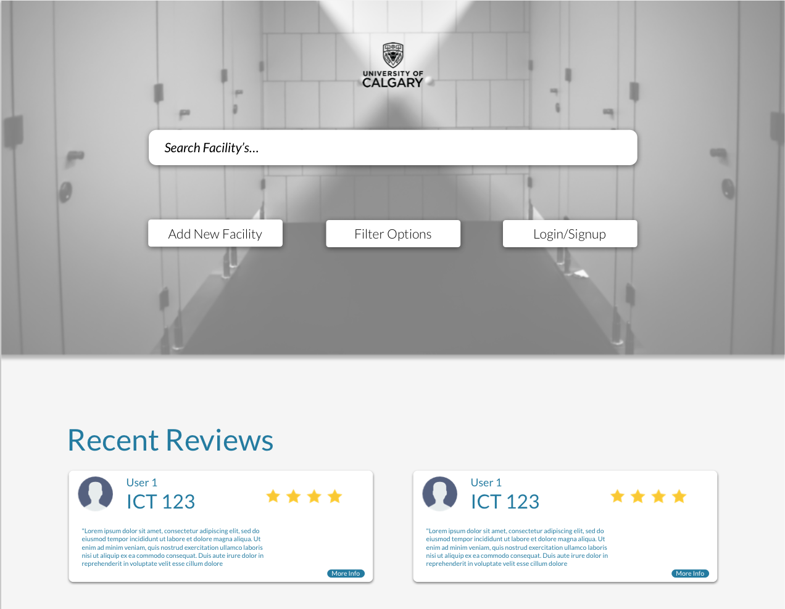
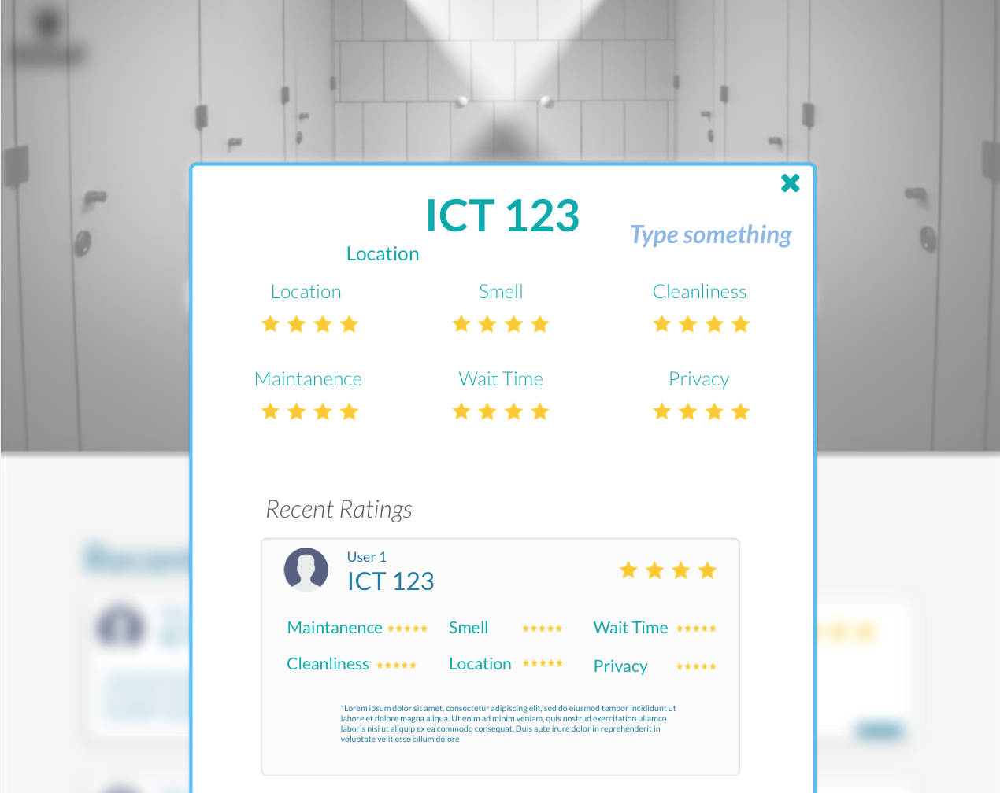
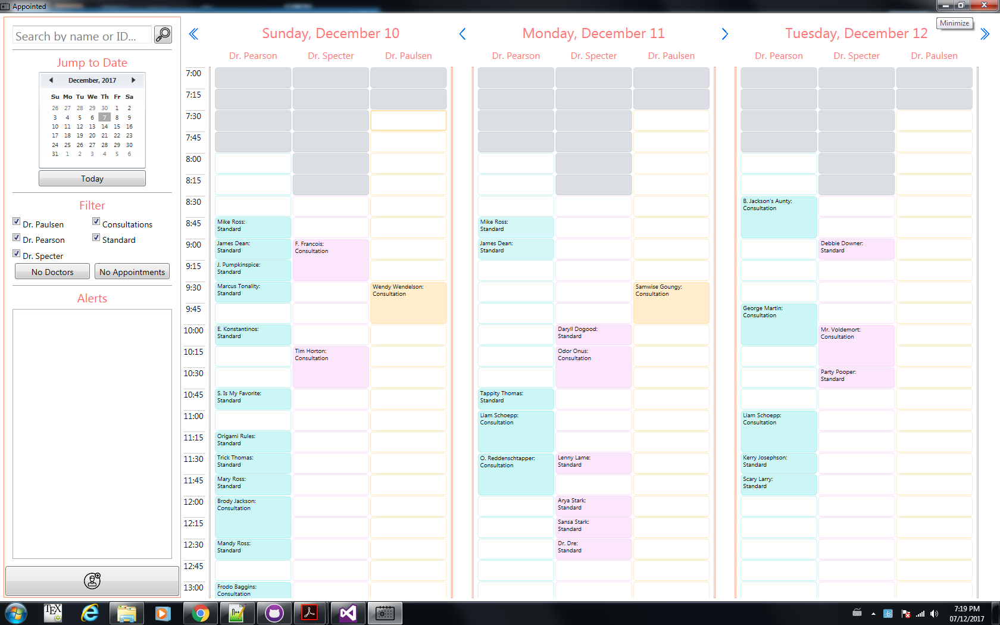

#  Critical Mass Interview Assignment
### Brody Jackson

#### Work / Project Examples

* The first piece of work I’d like to share is an application I recently created to help students at the University of Calgary rate the washroom facilities on campus. Initially, the motivation for this project was to continue learning about the creation of RESTful API’s using Node.js, however, it quickly turned into a full fledged application when I had the opportunity to build on it for a databases class. The service itself functions similar to the website “Rate My Professor” as students are able to leave reviews for bathrooms on campus, or search for them based on certain criteria. I began this project by creating a RESTful api with Express.js, which connects to a custom mySQL database containing washroom info. I was able to design a variety of endpoints for this API which successfully manipulated the information stored in the database using SQL queries. My next step was to flesh out the front-end using React.js and ensure these endpoints could be used to properly fetch and update the state of the app. Screenshots of the application can be found below and you can examine the project itself at the following github repo:

  [Github Link](https://github.com/BrodyJackson/Appointed)
 
  
  
  
* Another project I’ve recently worked on is a medical booking system called Appointed. This was a group assignment for an HCI class where we were asked to build a full fledged system with user experience as the main concern. My role in this team was to create the overall design for the system, in addition to helping with the construction of the front end. This was a WPF application and as such we developed it using C# for functionality and XAML for the views. Through this work I learned a lot about creating products with user accessibility in mind, without sacrificing the capabilities of the system. During this process the biggest challenge I faced was having to continuously refine the design as additional user types needed to be considered. Screenshots of this final design can be found below, and the github repo can be viewed at:

  [Github Link](https://github.com/BrodyJackson/PeeOrFlee)
 
  
  
* The final thing I’d like to talk about is my work as an intern at White Whale Analytics. Throughout this experience I worked on a variety of tasks for a business insights web application the company was building. I took this opportunity to tackle problems on both the front-end and back-end of the system, and gained experience working with a variety of technologies. More specifically, I used React.js to create responsive components that were utilized in the system, MongoDB to store important information on the backend of the system, and Hapi.js to create endpoints linking these two aspects together. This was an incredible experience, as not only was I able to increase my skills as a developer, but gain experience in a real industry environment.

#### Inspiration

* An article that really inspired me in a technical sense, is about the BEM CSS model (Block, Element, Modifier). Before reading this I didn’t give much thought to how I organized my styling, and worked with CSS by simply having a chaotic file of rules. However, reading these guidelines changed that perspective and I have starting working to structure my CSS in a way that cuts down on confusion. I think this will have a large impact on the scalability of my projects, as I have found that having more organization in my styles makes them much easier to work with.

  [Article Link](http://getbem.com/introduction/)

* One piece of work that I find very inspiring is an article on the AI revolution by Tim Urban. I found he did an excellent job generalizing such a broad topic, in a way that gives readers a sense of the immense possibilities currently in the field of computing. After reading this article I was blown away by how disruptive future technologies could be to our current way of life, and was motivated to continue developing skills which may be useful as we continue towards this unfamiliar future. In a technical sense, this drove me to learn a little bit more about some of the libraries that are being used in machine learning applications, such as scikit-learn for python. 

  [Article Link](https://waitbutwhy.com/2015/01/artificial-intelligence-revolution-1.html )
 
* Since I am working towards degrees in both Computer Science and Biology, I am always interested in projects that are able to blur the lines between the two fields. In fact, I recently came across an incredible open source project called genome maps which is a web based visualization tool for genomic data. I think it’s amazing that we are able to use any browser to scan over the entire human genome without a second thought. I find projects like this inspiring as they have the potential to drastically improve our understanding of ourselves, and have incredible applications in human health and wellness.

  [Website](http://www.genomemaps.org/)  
  [Github Repo Link](https://github.com/opencb/genome-maps)
  

#### Focus

* If I had completely free reign over what I wanted to do this summer, I would use the opportunity to develop an interesting side project that I’ve been thinking about. I am currently in a class about Evolutionary Biology, which focuses on many of the mathematical models behind the forces that drive changes in organisms. My professor was recently talking about how it is sometimes hard to visualize the relationships that these models have with each other, and to understand what these numbers they provide actually mean. I think it would be a really interesting experience to develop a web application which abstracts this confusion away, and allows people to see a visualization of how changing certain things in an organism's environment can change their survivability. 

  I recently attended the Calgary Hacks competition at the University of Calgary, and had the chance to begin learning Vue.js. I found this framework to be very intriguing, but did not get enough of an opportunity to really grasp how to use it. Because of this, I think that building the visualization project with it would be an excellent chance to continue learning the intricacies of the framework. In addition, I’d also take the opportunity to learn some sort of JS visualization library to display information such as D3.js.

#### Code Challenge

* A link to my completed code challenge can be found on codepen here: [Coding Challenge](https://codepen.io/BrodyJackson/pen/rJdLBX) 

